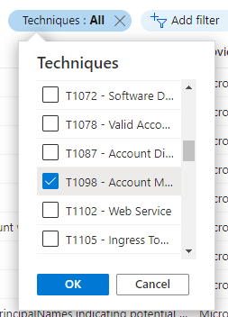
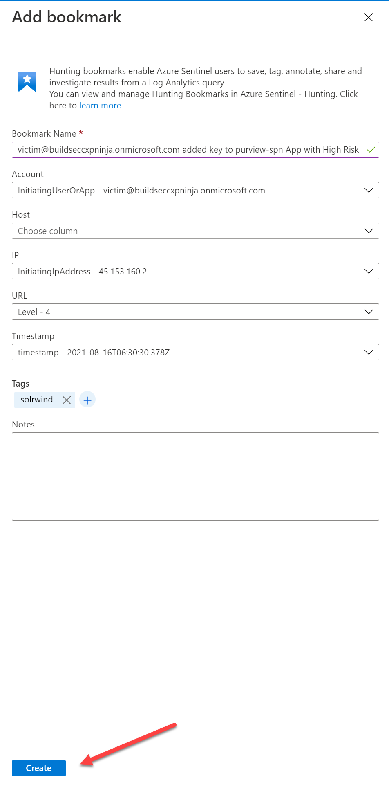
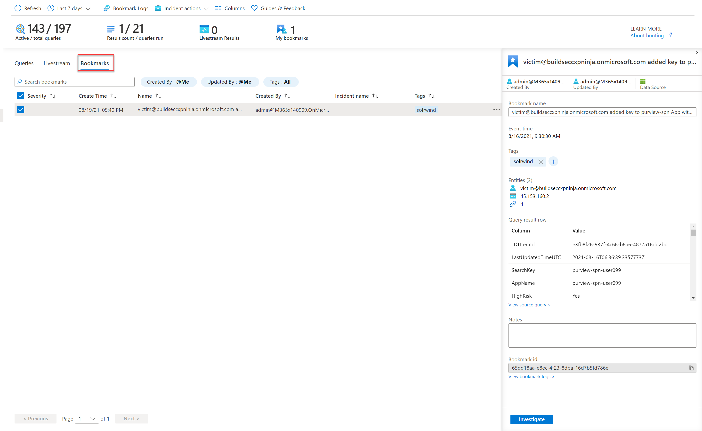
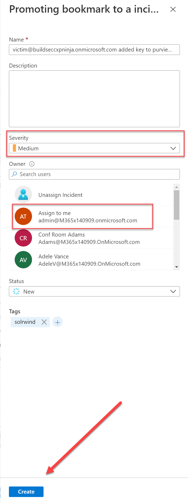
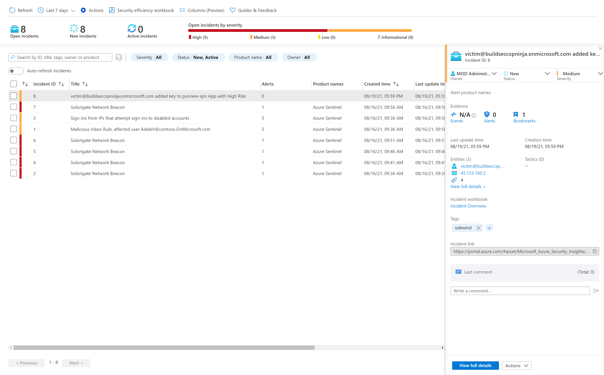

# Module 5 - Hunting

#### 🎓 Level: 300 (Intermediate)
#### ⌛ Estimated time to complete this lab: 40 minutes

This module will guide you through a proactive threat hunting procedure and will review Azure Sentinel’s rich hunting features.

#### Prerequisites
This module assumes that you have completed [Module 1](Module-1-Setting-up-the-environment.md), as the data and the artifacts that we will be using in this module need to be deployed on your Azure Sentinel instance.

### Exercise 1: Hunting on a specific MITRE technique


Our security researchers shared the following article describing techniques used in the SolarWinds supply chain: 
[Identifying UNC2452-Related Techniques for ATT&CK ](https://medium.com/mitre-attack/identifying-unc2452-related-techniques-9f7b6c7f3714)

Based on the article, our SOC leads understand that to be able to see the full picture of the attack campaign and spot anomalies on our data set, we need to run a proactive threat hunt based on the MITRE tactics and techniques described in this article.
1.	Review the above article that highlights MITRE attack techniques and the corresponding tools and methods. In this exercise, we will focus on T1098. To get a greater understanding of this technique, review this article: https://attack.mitre.org/techniques/T1098/

2.	On the left navigation click on Hunting


3.	In the hunting page, we can see that Azure Sentinel provides built-in hunting queries to kick start the proactive hunting process. On the metric bar we can see statistics about how many queries are “active” and have the required data sources to run in your environment.   There are also metrics showing how many queries have been run in during your current session, and how many of these queries produced results. We also see counts of the number of Livestream results and bookmarks created during the hunting process. 


4.	On the top action bar, shown in the above diagram, we can find the **Run All queries** button. Clicking on this button runs all active queries. This can take a significant amount of time depending on the number of queries and amount of log data being queried. To get results faster, it helps to filter down the set of queries to the specific set you need to run. 

5. Azure Sentinel provides many different attributes to filter down to just the queries you want to run. To filter by MITRE technique, click **Add filter**, select **Techniques**, and press **Apply**.


6.	In the **Techniques** value field, uncheck the select all and only select **T1098** and click OK.



7.	Review all the queries in the table using this technique. In this phase we can multi-select all of queries run them as a batch.

To do so, press on the multi-select checkboxes for the queries you want to run. Notice that the **Run All Queries** button has changed into the **Run selected queries (Preview)** button. Click this button to run the queries.  
**Note**: in some cases, you will need to modify the selected time range based on the time you deploy the lab to get query results.


8.	Once we press on the **Run selected queries (Preview)** the results is start popping on the screen, in our case we immediately spot that the **Adding credentials to legitimate OAuth Applications** query returns several results.
9.	Select this query and in the right pane press on **View Results**. This will navigate us to the log analytics screen to view the hunting query content and run it.
10.	On the **Logs** screen, once the hunting query finishes executing, we can see all the data that returned with the parsed fields and columns. From high overview we can see that we have the actor IP and the username that run this operation. 
11. Expand one of the results and check the fields. As you can see, we are able to spot the Azure AD application name, the added key name and type the IP, username of the actor and other relevant information that help us understand the specific action.
12.	Our SOC analysts needs to know which application from all the above result set is critical and has a security risk. One way to do this is to open Azure Active Directory for each application from the hunting results, check their permissions, and validate the risk. Our SOC analyst follows the organization knowledge base that guides him to review a list for all the AAD applications with their risk levels.
13.	On the **Logs** screen press on the **+** icon to open a new search tab and run the above query

 ```powershell
_GetWatchlist('HighRiskApps')
 ```


As you can see, this watchlist stores the application name, risk level and permissions. To correlate this information with our hunting results set, we need to run a simple join query.

14.	On the same tab, edit the query and join it with the hunting data. For this demo, you can copy the query below and overwrite your existing query. Now run this new query to see the results. 

 ```powershell
_GetWatchlist('HighRiskApps')
| join 
(
AuditLogs_CL
| where OperationName has_any ("Add service principal", "Certificates and secrets management")
| where Result_s =~ "success"
| mv-expand target = todynamic(TargetResources_s)
| where tostring(tostring(parse_json(tostring(parse_json(InitiatedBy_s).user)).userPrincipalName)) has "@" or tostring(parse_json(InitiatedBy_s).displayName) has "@"
| extend targetDisplayName = tostring(parse_json(TargetResources_s)[0].displayName)
| extend targetId = tostring(parse_json(TargetResources_s)[0].id)
| extend targetType = tostring(parse_json(TargetResources_s)[0].type)
| extend eventtemp = todynamic(TargetResources_s)
| extend keyEvents = eventtemp[0].modifiedProperties
| mv-expand keyEvents
| where keyEvents.displayName =~ "KeyDescription"
| extend set1 = parse_json(tostring(keyEvents.newValue))
| extend set2 = parse_json(tostring(keyEvents.oldValue))
| extend diff = set_difference(set1, set2)
| where isnotempty(diff)
| parse diff with * "KeyIdentifier=" keyIdentifier: string ",KeyType=" keyType: string ",KeyUsage=" keyUsage: string ",DisplayName=" keyDisplayName: string "]" *
| where keyUsage == "Verify" or keyUsage == ""
| extend AdditionalDetailsttemp = todynamic(AdditionalDetails_s)
| extend UserAgent = iff(todynamic(AdditionalDetailsttemp[0]).key == "User-Agent", tostring(AdditionalDetailsttemp[0].value), "")
| extend InitiatedByttemp = todynamic(InitiatedBy_s)
| extend InitiatingUserOrApp = iff(isnotempty(InitiatedByttemp.user.userPrincipalName), tostring(InitiatedByttemp.user.userPrincipalName), tostring(InitiatedByttemp.app.displayName))
| extend InitiatingIpAddress = iff(isnotempty(InitiatedByttemp.user.ipAddress), tostring(InitiatedByttemp.user.ipAddress), tostring(InitiatedByttemp.app.ipAddress))
| project-away diff, set1, set2, eventtemp, AdditionalDetailsttemp, InitiatedByttemp
| project-reorder
   TimeGenerated,
   OperationName,
   InitiatingUserOrApp,
   InitiatingIpAddress,
   UserAgent,
   targetDisplayName,
   targetId,
   targetType,
   keyDisplayName,
   keyType,
   keyUsage,
   keyIdentifier,
   CorrelationId
| extend
   timestamp = TimeGenerated,
   AccountCustomEntity = InitiatingUserOrApp,
   IPCustomEntity = InitiatingIpAddress
   ) on $left.AppName == $right.targetDisplayName
| where HighRisk == "Yes"
 ```

As you can see the above query uses a **join** operator to join two data streams: the high risk watchlist and the “Adding credentials to legitimate OAuth Applications” hunting query results. We are joining these two datasets based on the application name column. We filter the results with a **where** operator to see only the high risks applications.

**Please keep this window open as we will continue to work on it in the next exercise.**

### Exercise 2: Bookmarking hunting query results 

While reviewing query results in Log Analytics, we use Azure Sentinel’s bookmarking feature to store and enrich these results. We can extract entity identifiers and then use entity pages and the investigation graph to investigate the entity.  We can add tags and notes to the results to say why it is interesting.  Bookmarks will also preserve the query and time range that generated the specific row result so that analysts can reproduce the query in the future  
If as part of our investigation, we determine that the bookmarked query result contains malicious activity, we can create a new incident from the bookmark, or attach the bookmark to an existing incident. 

1.	On the **Logs** screen, open the **join** hunting query from **Exercise**.  Select one or more rows using the checkbox on the left-hand side of the table. Click **Add bookmark** in the action menu just about the results table.


2.	On the right-hand bookmark pane modify the **Bookmark Name** to **victim@buildseccxpninja.onmicrosoft.com** added key to **purview-spn** App with **High Risk** 
3.	Using the drop down in the **entities** section of the **bookmark pane**, map the **Account** entity to the InitiatingUserOrApp column.  You can see a sample value in the drop down.  In the diagram below, the sample value is **victim@buildseccxpninja.onmicrosoft.com**.  
4.	Map the IP entity to the InitiatingIpAddress column. In the diagram below, you can see the sample value **45.153.160.2**. 
5.	We will also add a tag to map it to the main attack story. In the **tags** section write, **“solorwinds”**
6.	Press **Create** at the bottom of the blade to create the bookmark.




### Exercise 3: Promote a bookmark to an incident

1.	In the Hunting page, navigate to the **Bookmarks** tab to see our newly created bookmark.




2.	In the right pane, we can click the **Investigate** button to investigate the bookmark using the **Investigation Graph** the same way that we can investigate an incident.
3.	To create a new incident from the bookmark, select the bookmark and select **Incident Actions** in the top menu bar and select **Create new Incident**. 
**Note** that you also have the option to attach the bookmark to an existing incident. 


4.	Select the **Severity** for the incident, assign the incident to your yourself, and click **Create**.



5.	Navigate to the incident blade and review the newly promoted incident we just created.



**Congratulations, you have completed Module 5!**. You can now continue to **[Module 6 - Watchlists](./Module-6-Watchlists.md)**